<div align="center">

# Human Touch

### Make AI-Generated Designs look less AI-Generated

A composable art-direction and visual-QA skill for AI agents.

**Images · Websites · 3D · Pixel art · Motion**

[Explore the examples](#the-showcase) &nbsp; / &nbsp; [Install](#install) &nbsp; / &nbsp; [Read the skill](skills/human-touch/SKILL.md)

</div>

---

Human Touch works alongside your creative tools. It helps an agent make deliberate decisions about composition, materials, hierarchy, continuity, and pacing—while preserving the style you asked for.

## The showcase

**Fifteen briefs. Thirty examples.** The left version uses the base workflow; the right adds Human Touch art direction. Click an image to inspect it. Yolo previews animate directly in GitHub; click one for the full MP4.

These are illustrative comparisons, not a controlled benchmark. [Read the methodology](examples/README.md#how-these-were-made) · [See the exact prompts](examples/prompts.json) · [Open the local gallery](examples/index.html)

### 01 / Cookie shop

*Pink & black · website mockup*

<table>
<tr><th width="50%">Without Human Touch</th><th width="50%">With Human Touch</th></tr>
<tr><td><a href="examples/without-skill/cookie-website.png">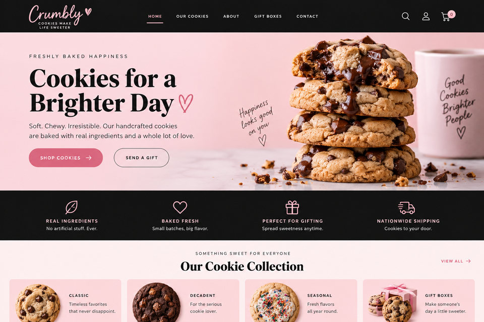</a></td><td><a href="examples/with-skill/cookie-website.png">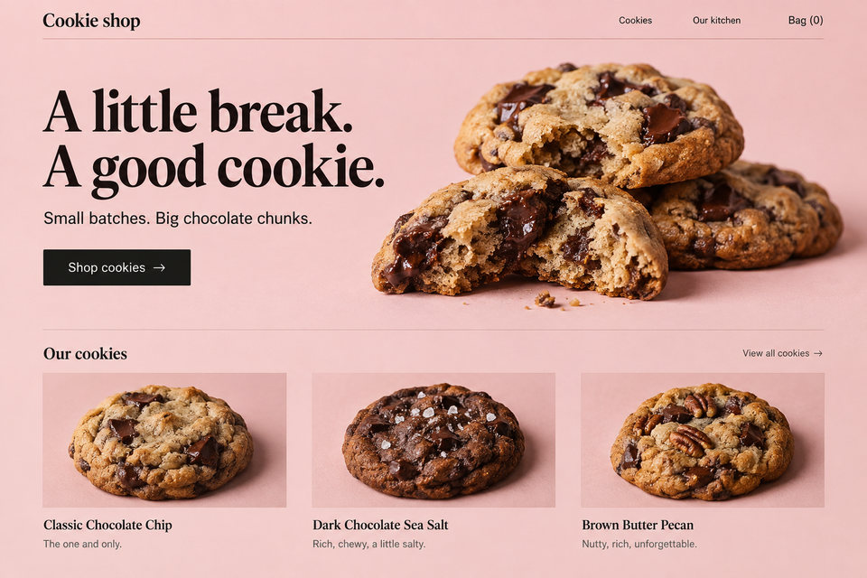</a></td></tr>
</table>

A bakery storefront, from a promotional layout to a focused shop page.

### 02 / Shoes

*Red & black · website mockup*

<table>
<tr><th width="50%">Without Human Touch</th><th width="50%">With Human Touch</th></tr>
<tr><td><a href="examples/without-skill/shoes-website.png"></a></td><td><a href="examples/with-skill/shoes-website.png">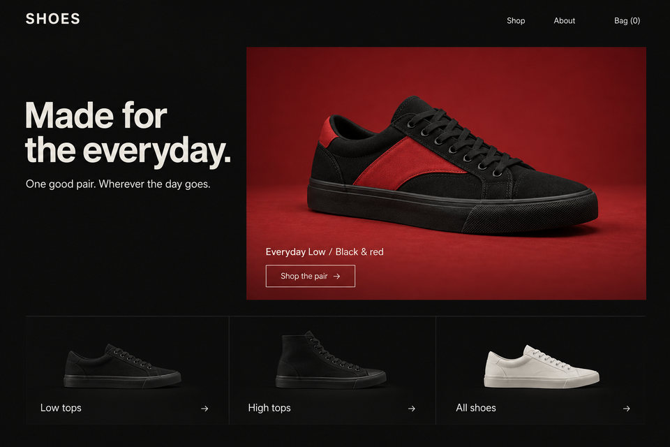</a></td></tr>
</table>

Two ways to frame the product: dramatic campaign imagery and a grounded catalogue.

### 03 / Lee's SmartHouse

*Connected appliances, lighting, entry & alarms · website mockup*

<table>
<tr><th width="50%">Without Human Touch</th><th width="50%">With Human Touch</th></tr>
<tr><td><a href="examples/without-skill/lees-smarthouse.png">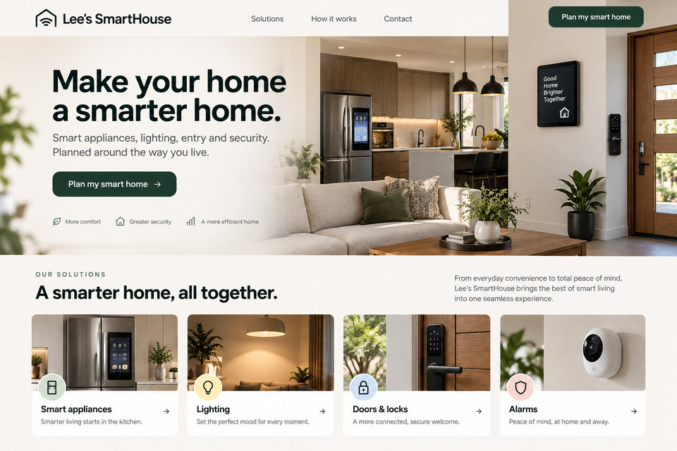</a></td><td><a href="examples/with-skill/lees-smarthouse.png">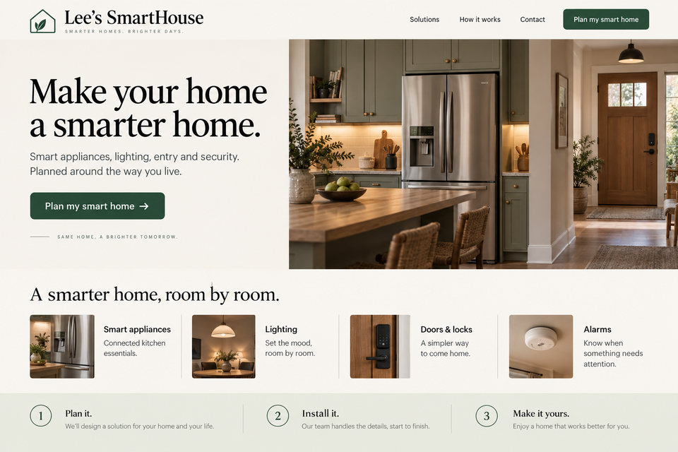</a></td></tr>
</table>

All the bells and whistles, planned around the home. The directed version combines warm interiors, serif headings, compact solution categories, and a clear planning-to-installation sequence.

### 04 / A quiet sunset

*Calm colors · watercolor illustration*

<table>
<tr><th width="50%">Without Human Touch</th><th width="50%">With Human Touch</th></tr>
<tr><td><a href="examples/without-skill/watercolor-sunset.png"></a></td><td><a href="examples/with-skill/watercolor-sunset.png"></a></td></tr>
</table>

A change in palette, composition, and the treatment of paper and paint.

### 05 / A place to call home

*Real-estate closing · stock photography*

<table>
<tr><th width="50%">Without Human Touch</th><th width="50%">With Human Touch</th></tr>
<tr><td><a href="examples/without-skill/house-closing.png"></a></td><td><a href="examples/with-skill/house-closing-relaxed-hand.png"></a></td></tr>
</table>

A real estate agent and a happy married couple close on their new home. The baseline captures the signature; the directed image focuses on a shared glance with the keys on the table. AI-generated stock-style photography.

### 06 / A signal from the shore

*Oxenfree-inspired · 2D character illustration*

<table>
<tr><th width="50%">Without Human Touch</th><th width="50%">With Human Touch</th></tr>
<tr><td><a href="examples/without-skill/coastal-character.png">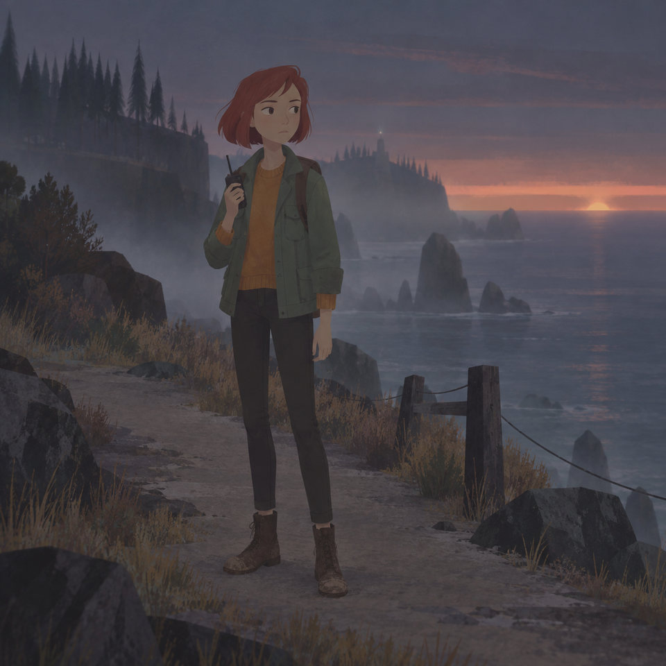</a></td><td><a href="examples/with-skill/coastal-character.png">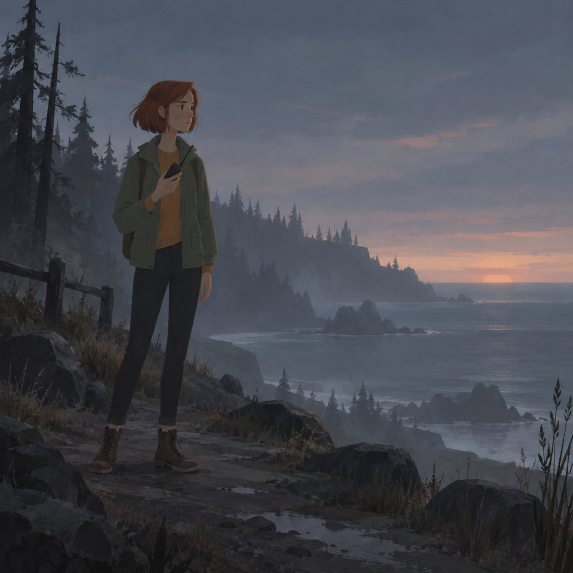</a></td></tr>
</table>

An original traveler listening to a radio on a misty coast. The directed composition gives her a more relaxed stance and opens up the shoreline to her right. Both are standalone 2D graphics.

### 07 / The lion

*Character study · pixel art*

<table>
<tr><th width="50%">Without Human Touch</th><th width="50%">With Human Touch</th></tr>
<tr><td><a href="examples/without-skill/pixel-art-lion.png"></a></td><td><a href="examples/with-skill/pixel-art-lion.png"></a></td></tr>
</table>

A scenic portrait and a quieter, silhouette-led character study.

### 08 / Polar

*Cute app mascot · transparent illustration*

<table>
<tr><th width="50%">Without Human Touch</th><th width="50%">With Human Touch</th></tr>
<tr><td><a href="examples/without-skill/polar-mascot.png"></a></td><td><a href="examples/with-skill/polar-mascot.png">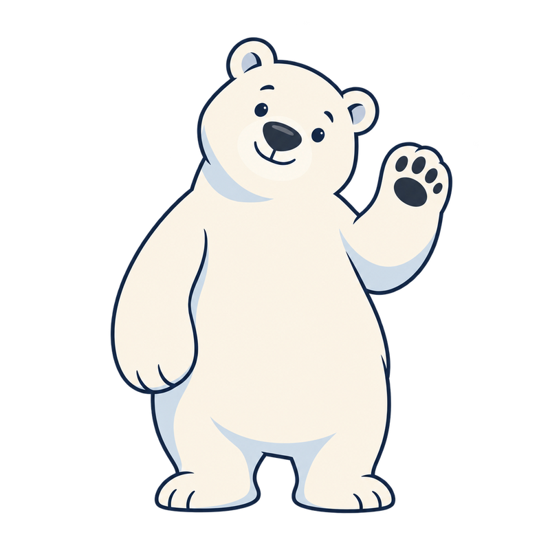</a></td></tr>
</table>

Two friendly greetings for Polar: a softly shaded cartoon and a simpler outlined character with a restrained palette and relaxed expression. Both are transparent PNGs.

### 09 / Swedish Vallhund

*Pixar-style · 3D character illustration*

<table>
<tr><th width="50%">Without Human Touch</th><th width="50%">With Human Touch</th></tr>
<tr><td><a href="examples/without-skill/swedish-vallhund.png">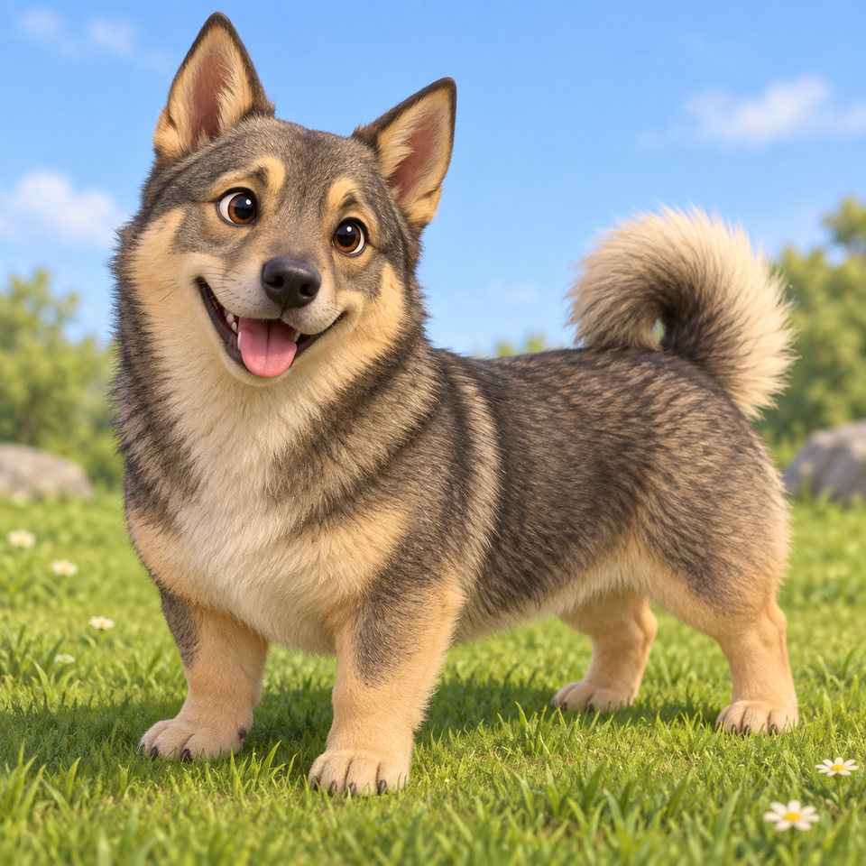</a></td><td><a href="examples/with-skill/swedish-vallhund.png">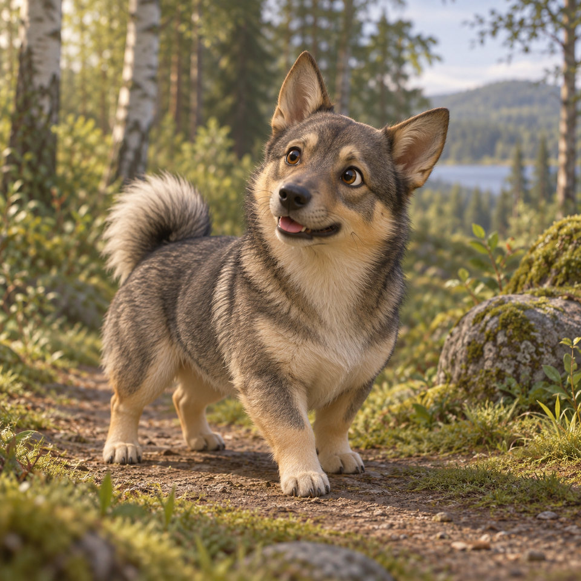</a></td></tr>
</table>

A friendly little herding dog in two animated-feature interpretations. The directed version adds an attentive head tilt, a quieter expression, and a birch-woodland setting while preserving the breed's long body, short legs, and sable coat.

### 10 / Mobile game UI

*Cozy adventure game · 2D UI pack*

<table>
<tr><th width="50%">Without Human Touch</th><th width="50%">With Human Touch</th></tr>
<tr><td><a href="examples/without-skill/mobile-game-ui.png">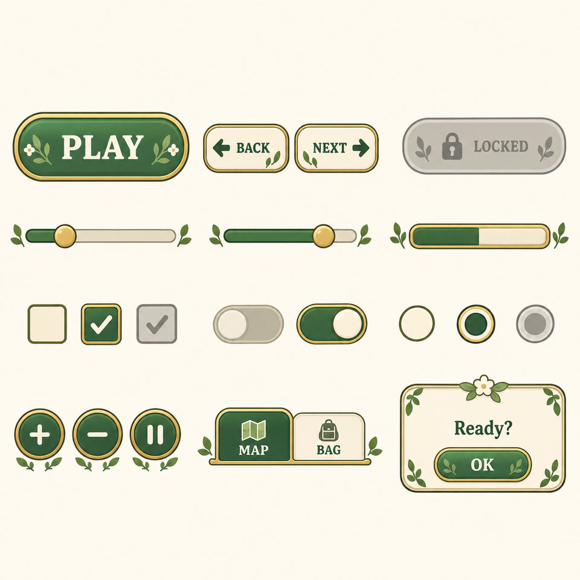</a></td><td><a href="examples/with-skill/mobile-game-ui.png">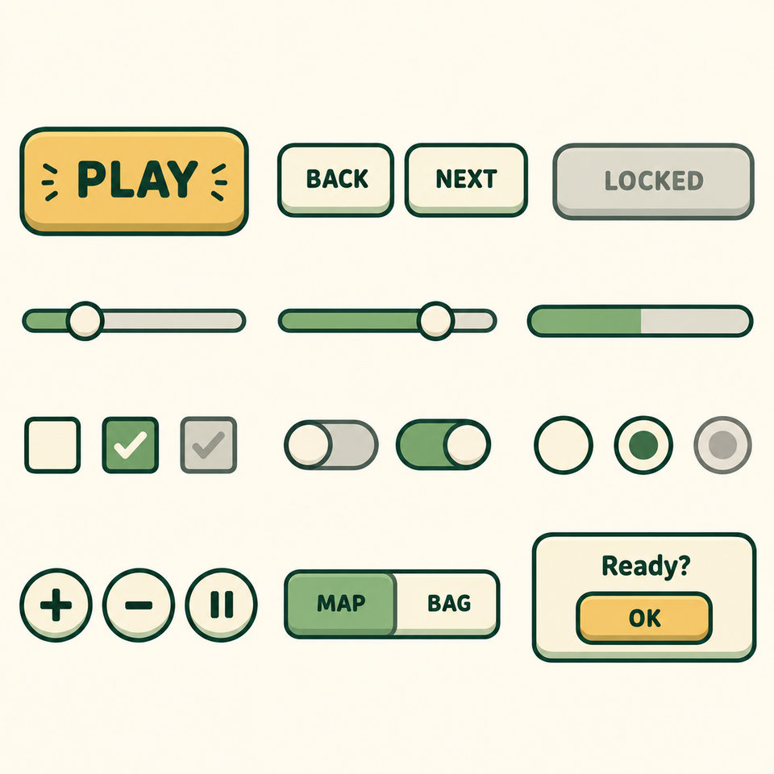</a></td></tr>
</table>

Buttons, sliders, checkboxes, toggles, radio controls, progress, tabs, and a dialogue panel. The directed version uses simpler outlines and a gold primary action within the same green-and-cream theme. These are visual asset sheets, ready for further production work.

### 11 / ReadFree

*Read unlimited free books · mobile app mockup*

<table>
<tr><th width="50%">Without Human Touch</th><th width="50%">With Human Touch</th></tr>
<tr><td><a href="examples/without-skill/readfree-app.png">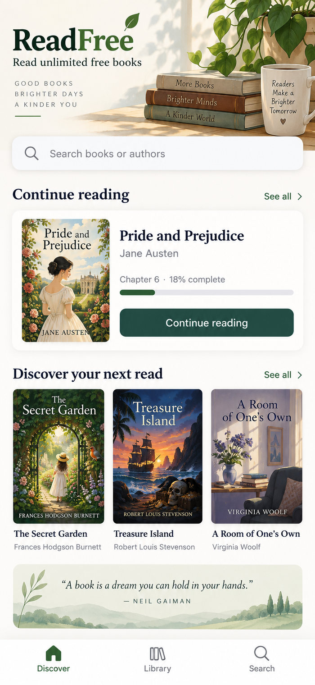</a></td><td><a href="examples/with-skill/readfree-app.png">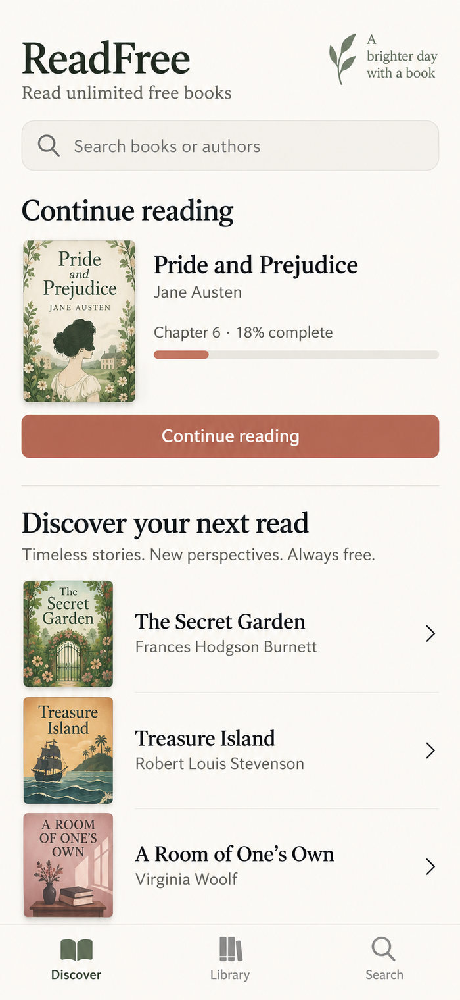</a></td></tr>
</table>

Find your next book or pick up where you left off. The directed version emphasizes the reading action, a warm paper palette, and a scannable list of titles and authors. Static app concepts with original cover artwork.

### 12 / Oversoul

*Celeste-inspired · Steam capsule art*

<table>
<tr><th width="50%">Without Human Touch</th><th width="50%">With Human Touch</th></tr>
<tr><td><a href="examples/without-skill/oversoul-capsule.png">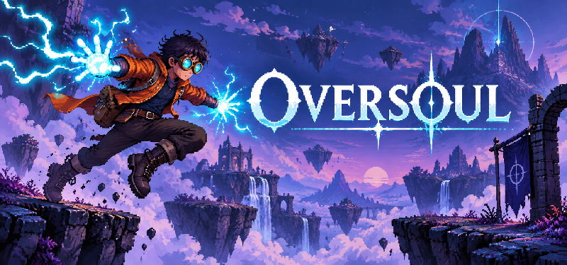</a></td><td><a href="examples/with-skill/oversoul-capsule.png">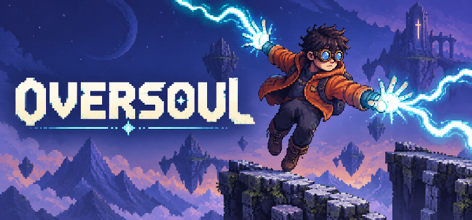</a></td></tr>
</table>

A goggle-wearing hero fires electricity from his palms above floating mountain platforms. The directed version pairs a bold pixel title with quieter sky and a distinct airborne silhouette. Wide capsule-art concepts for a 2D pixel-art game.

### 13 / Mellow

*Yellow bird · app icon*

<table>
<tr><th width="50%">Without Human Touch</th><th width="50%">With Human Touch</th></tr>
<tr><td><a href="examples/without-skill/mellow-icon.png"></a></td><td><a href="examples/with-skill/mellow-icon-3d-sky.png"></a></td></tr>
</table>

A fluffy yellow bird against a blue sky and a matte 3D character with soft lighting against a blue sky. Two interpretations of a friendly app icon, with square artwork ready for platform masking.

### 14 / RealBeef Meatsticks

*Cattle mark & wordmark · logo design*

<table>
<tr><th width="50%">Without Human Touch</th><th width="50%">With Human Touch</th></tr>
<tr><td><a href="examples/without-skill/realbeef-logo.png">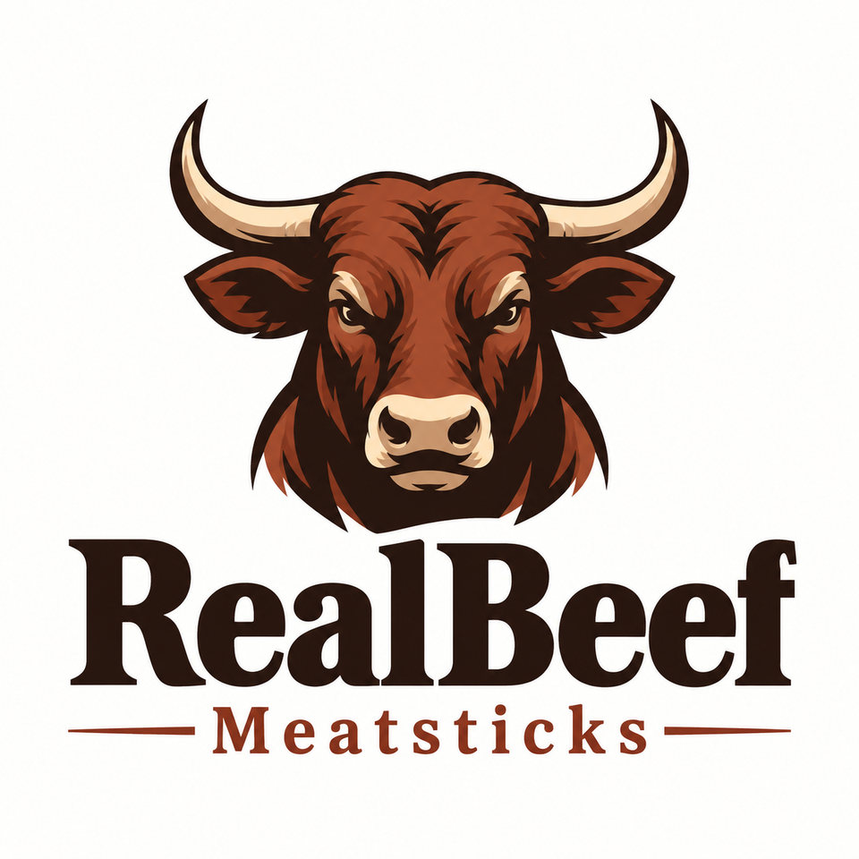</a></td><td><a href="examples/with-skill/realbeef-logo.png">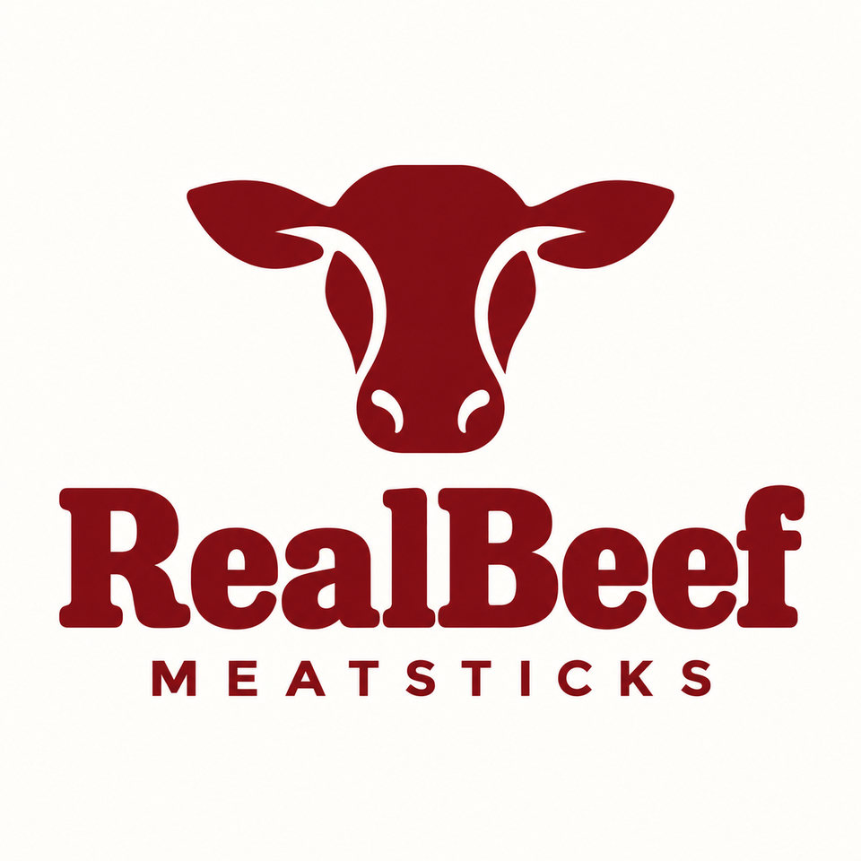</a></td></tr>
</table>

A detailed bull illustration and a simpler cattle mark with bold red lettering. Raster logo concepts for later vector refinement.

### 15 / Yolo

*Energetic sports ad · Hyperframes · 12 seconds*

<table>
<tr><th width="50%">Without Human Touch</th><th width="50%">With Human Touch</th></tr>
<tr><td><a href="examples/without-skill/yolo-ad.mp4">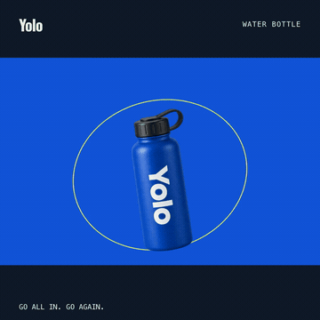</a></td><td><a href="examples/with-skill/yolo-ad.mp4">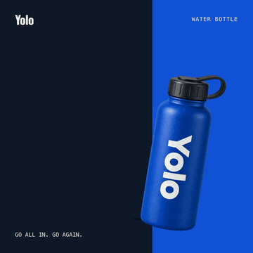</a></td></tr>
</table>

The same bottle and copy, with different composition and motion direction.

[Watch baseline](examples/without-skill/yolo-ad.mp4) · [Watch Human Touch](examples/with-skill/yolo-ad.mp4) · [Editable Hyperframes projects](examples/yolo/README.md)

---

## Install

Give your agent this instruction:

```text
Install the Human Touch skill from
https://github.com/landonhughes/human-touch/tree/main/skills/human-touch
```

Then create as usual. [Implicit invocation](skills/human-touch/agents/openai.yaml) is enabled for visual work. You can also ask directly:

> Use human-touch to art-direct this image, website, model, or animation.

## Works with your tools

| Your workflow | Human Touch adds |
| --- | --- |
| Image generation & illustration | Composition, material coherence, visual hierarchy |
| Websites & UI | Clear reading order, useful content, intentional section rhythm |
| 3D modeling & rendering | Silhouette, proportions, material response, purpose-specific geometry checks |
| Pixel art & sprites | Readable clusters, palette discipline, grid and frame consistency |
| Animation & video | Motivated motion, continuity, pacing, and a purposeful ending |

The specialized tool handles creation. Human Touch provides an art-direction and review layer.

**Intentional style stays.** Cinematic light, neon, maximalism, glossy surfaces, surrealism, and expressive motion are all valid. The skill questions accidental choices; it does not impose a single house style.

<details>
<summary><strong>Explore the skill references</strong></summary>

- [Core workflow](skills/human-touch/SKILL.md)
- [Web design](skills/human-touch/references/web-design.md) · [UI design](skills/human-touch/references/ui-design.md) · [Typography](skills/human-touch/references/typography.md)
- [Photography](skills/human-touch/references/photography.md) · [Product mockups](skills/human-touch/references/product-mockups.md) · [Illustration](skills/human-touch/references/illustration.md)
- [3D modeling](skills/human-touch/references/3d-modeling.md) · [Pixel art](skills/human-touch/references/pixel-art.md)
- [Animation](skills/human-touch/references/animation.md) · [Video design](skills/human-touch/references/video-design.md)
- [AI-tell diagnostics](skills/human-touch/references/anti-ai-tells.md) · [Final review](skills/human-touch/references/final-review.md)

A rendered image does not validate an editable 3D model. Generated pixel-style artwork does not establish that a sprite is ready for a game engine. The references distinguish visual review from production checks.

</details>

<details>
<summary><strong>Repository guide</strong></summary>

| Path | Contents |
| --- | --- |
| `skills/human-touch/` | Installable skill, invocation metadata, specialist references |
| `examples/with-skill/` | Human Touch images, videos, and preview posters |
| `examples/without-skill/` | Baseline images, videos, and preview posters |
| `examples/yolo/` | Editable Yolo ads and GitHub GIF previews |
| `examples/prompts.json` | Exact prompts and production briefs |
| `examples/index.html` | Local comparison gallery with video playback |
| `plugin.json` | Plugin metadata |

</details>

---

<div align="center">

[Contribute](CONTRIBUTING.md) &nbsp; · &nbsp; [MIT License](LICENSE)

© 2026 Landon Hughes

</div>
