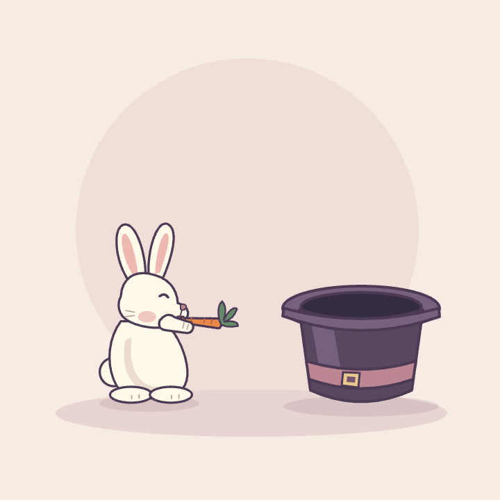

# Carrot intermission

Two seamless eight-second bunny loops, rendered directly to GIF with **Hyperframes 0.8.85**. Both nibble a carrot, hop into a magician's hat, hop back to the starting spot, and resume nibbling.

| Hyperframes only | Hyperframes + Human Touch |
| --- | --- |
|  |  |

## What changes

The same original SVG illustration, palette, eight-second story, camera, and endpoints are used in both versions. The baseline uses smooth direct jumps and regular bites. Human Touch adds a short anticipation crouch, stretch on takeoff, delayed asymmetric ears, landing compression, and less regular nibbling. Both preserve coherent attachment of the carrot to the mouth and paw.

These are authored in the same agent session. This comparison demonstrates explicit motion-direction choices, not independent skill-disabled runs. Neither version is deliberately degraded. The bunny is a native vector composition rather than an image-generation output.

## Timing

- **0–1.7 s:** nibble, with a quiet opening pose.
- **1.7–3.3 s:** prepare, jump over the rim, and disappear into the hat.
- **3.3–4.1 s:** a short hidden hold.
- **4.1–5.5 s:** pop out and arc back to the starting spot, nibbling on the return hop.
- **5.5–8 s:** land, nibble, and return to the exact opening state.

The carrot keeps its bitten silhouette; chewing is a bounded mouth/paw movement, so the prop does not visibly regrow at the seam. The last encoded 25 fps frame and first frame share the same held pose. Both GIFs loop indefinitely and are silent.

## Source

- [Shared illustration](scene.svg) — original layered bunny, carrot, hat and stage.
- [Shared motion](motion.js) — deterministic time-to-pose function, with explicit variant branches.
- [Build script](build.py) — writes standalone compositions from the shared sources.
- [Baseline project](without-skill/index.html) and [Human Touch project](with-skill/index.html).
- [Browser verification](verify.cjs) — actual rendered-pixel seam checks, occlusion, nibbling, hop movement, and reverse-seek determinism.

Each project vendors GSAP 3.14.2 from [jsDelivr](https://cdn.jsdelivr.net/npm/gsap@3.14.2/dist/gsap.min.js), retaining its distribution header and license link. No runtime network fetches, remote fonts, audio, or generated-image dependencies are required by the compositions. Hyperframes and its browser still need installing for reproduction. Open a project through Hyperframes Studio to play and seek it; the standalone HTML intentionally starts with its timeline paused.

## Reproduce

Requires Python 3, Node.js 22+, FFmpeg on PATH, and Hyperframes' Chromium renderer.

From the repository root:

```sh
python3 examples/bunny/build.py
```

From `examples/bunny/with-skill` (substitute `without-skill` for the baseline):

```sh
npm run check -- --snapshots --at 0,2.4,3.6,4.9,7.96
npm run dev
npm run render -- --format gif --fps 25 --gif-loop 0 --quality delivery --output ../../with-skill/bunny-loop.gif
```

Optional browser checks from the repository root, with Playwright available to Node:

```sh
NODE_PATH=/path/to/node_modules node examples/bunny/verify.cjs
```

With Pillow installed, verify the delivered GIF timing and decoded loop seams:

```sh
python3 examples/bunny/verify_gifs.py
```

Both projects pass Hyperframes runtime, layout-error, and motion checks. The single-scene compositions retain the advisory `nested_structure_needs_subcomposition` warning. The directed version also reports `rotation_pivot_drift`: its bounding-box center travels along a jump while the character rotates about its feet. This is intentional character motion, visually reviewed at takeoff, descent, exit and landing. There is no text to contrast-check.
