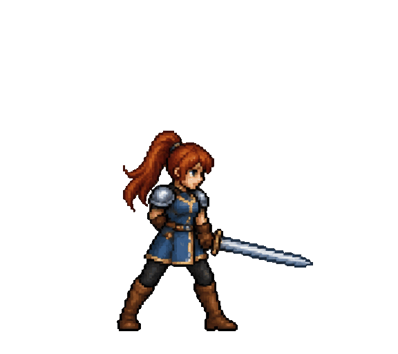
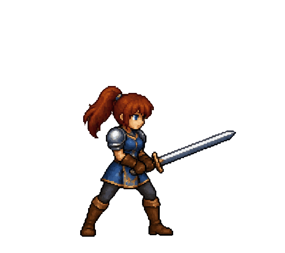

# Sword-swing animations

Eight frames from each original sheet, read left to right across the top row, then the bottom row. Both versions use the same timing and alignment method.

| Without Human Touch | With Human Touch |
| --- | --- |
|  |  |

- [Baseline PNG frames](../without-skill/sword-frames/) · [Human Touch PNG frames](../with-skill/sword-frames/)
- [Baseline source sheet](../without-skill/sword-spritesheet.png) · [Human Touch source sheet](../with-skill/sword-spritesheet.png)

Frames share a 576 × 512 transparent canvas, a boot-midpoint anchor at x=256, and a ground line at y=480. Cuts follow the transparent gutters, including the directed slash that extends beyond its nominal grid cell. Artwork is neither resized nor redrawn. PNGs preserve alpha; GIFs use binary transparency and a shared 255-color palette per animation.

Frame durations are 300, 140, 160, 90, 110, 120, 150, and 300 milliseconds: 1.37 seconds per infinite loop. These are previews of generated poses; proportions and the final-to-first transition are not perfectly continuous.

To reproduce with Python and Pillow installed:

```sh
python3 examples/sword/slice_sheets.py
```
